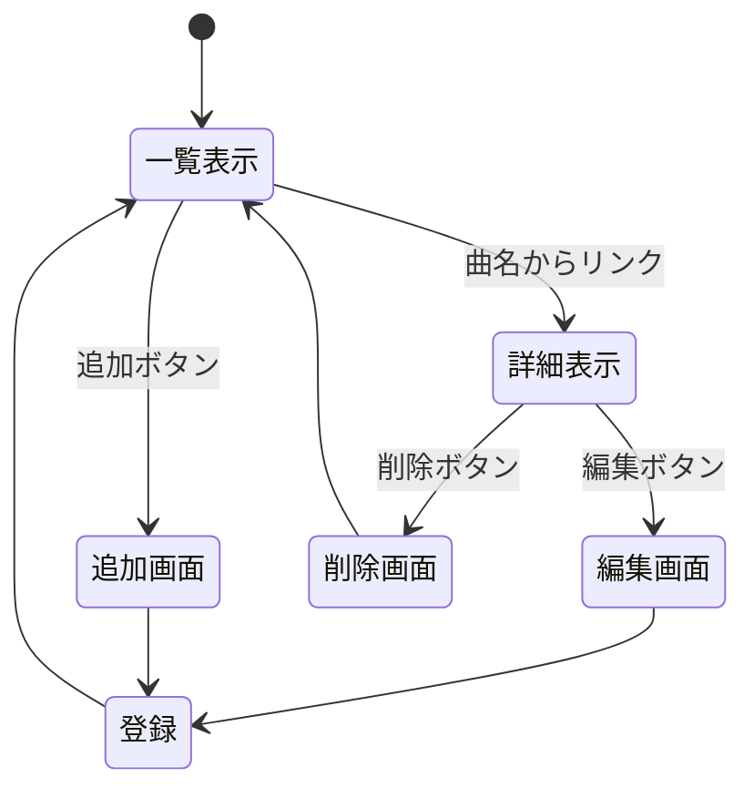

# 開発者用仕様書(仮)

## 1:phigros(音ゲー)の高難易度曲集計システム

### データ構造

項目名 | 型 | 内容
-|-|-
name|text|曲名
author_music|text|曲作者名
author_notes|text|譜面作者名
level|number(step:0.1)|難易度
score|number|最高スコア
bpm|number(step:0.1)|速度
notes_figure|number|ノーツ数
notes_density|number(step:0.1)|ノーツ密度
time|number|曲の時間

### ページ構造

ページ（リソース）名|メソッド|役割
-|-|-
report.js|-|Webサーバプログラム
phigros.ejs|GET|一覧表示
phigros_detail.ejs|GET|詳細表示
phigros_add.ejs|POST|追加画面
phigros_edit.ejs|PUT|編集画面
phigros_delete.ejs|DELETE|削除画面

### ページ遷移

## 2:物価上昇率が急激な食品集計システム

### データ構造

項目名 | 型 | 内容
-|-|-
name|text|食品名
cost|number|値段
uprate|number(step:0.1)|昨年比の値段上昇率
production|number|生産数

### ページ構造

ページ（リソース）名|メソッド|役割
-|-|-
report.js|-|Webサーバプログラム
foodcost.ejs|GET|一覧表示
foodcost_detail.ejs|GET|詳細表示
foodcost_add.ejs|POST|追加画面
foodcost_edit.ejs|PUT|編集画面
foodcost_delete.ejs|DELETE|削除画面

### ページ遷移

## 3:カラオケ人気曲集計システム

### データ構造

項目名 | 型 | 内容
-|-|-
name|text|曲名
author|text|作曲者
debut|number|公開日
time|number|再生時間
tone|text|キー
popularity|number|月間再生回数

### ページ構造

ページ（リソース）名|メソッド|役割
-|-|-
report.js|-|Webサーバプログラム
karaoke.ejs|GET|一覧表示
karaoke_detail.ejs|GET|詳細表示
karaoke_add.ejs|POST|追加画面
karaoke_edit.ejs|PUT|編集画面
karaoke_delete.ejs|DELETE|削除画面

### ページ遷移

