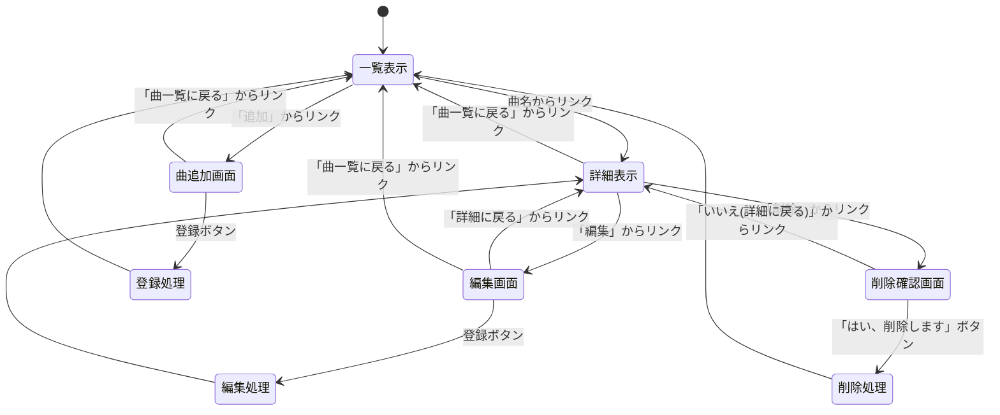
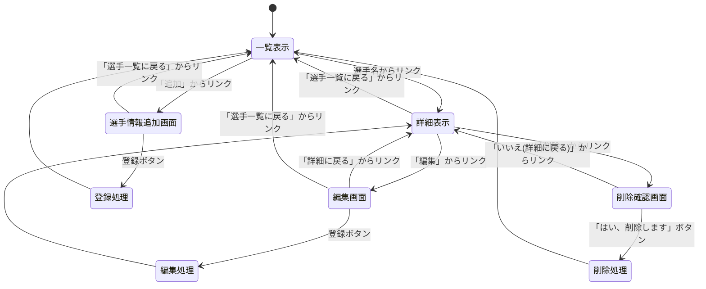
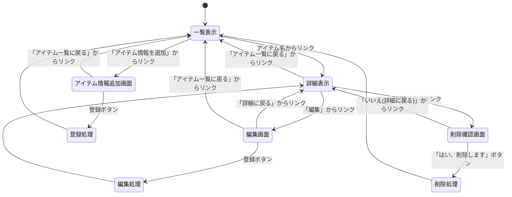

# 開発者用仕様書(仮)

## 1:phigros(音ゲー)の高難易度曲集計システム

### データ構造

項目名 | 型 | 内容
-|-|-
name|text|曲名
author_music|text|曲作者名
author_notes|text|譜面作者名
level|number(step:0.1)|難易度
bpm|text(step:0.1)|速度
notes_figure|number|ノーツ数
notes_density|number(step:0.1)|ノーツ密度
time|number|曲の時間
image|image|ジャケット絵

### ページ構造

ページ（リソース）名|メソッド|役割
-|-|-
report.js|-|Webサーバプログラム
phigros.ejs|GET|一覧表示
phigros_detail.ejs|GET|詳細表示
phigros_edit.ejs|POST|編集画面
phigros_delete_check.ejs|GET|削除確認画面
phigros_new.html|POST|曲追加画面

### ページ遷移

## 2:wtt（world table tennis） 男子選手データベース

### データ構造

項目名 | 型 | 内容
-|-|-
name|text|選手名
country|text|代表国
age|number|年齢
world_ranking|number|世界ランキング
result|number|過去の成績
hand|text|利き手
type|text|戦型（ラケット）
image|image|選手画像

### ページ構造

ページ（リソース）名|メソッド|役割
-|-|-
report.js|-|Webサーバプログラム
wtt.ejs|GET|一覧表示
wtt_detail.ejs|GET|詳細表示
wtt_edit.ejs|POST|編集画面
wtt_delete_check.ejs|GET|削除確認画面
wtt_new.html|POST|選手情報追加画面

### ページ遷移

## 3:deltarune 消費アイテム一覧

### データ構造

項目名 | 型 | 内容
-|-|-
name|text|アイテム名
chapter|text|登場チャプター
effect|text|効果
describe|text|アイテム説明
place|text|入手方法（場所）
plus_alpha|text|補足（特性など）
image|image|アイテムに関連するエリア画像

### ページ構造

ページ（リソース）名|メソッド|役割
-|-|-
report.js|-|Webサーバプログラム
deltarune.ejs|GET|一覧表示
deltarune_detail.ejs|GET|詳細表示
deltarune_edit.ejs|POST|編集画面
deltarune_delete_check.ejs|GET|削除確認画面
deltarune_new.html|POST|アイテム情報追加画面

### ページ遷移

